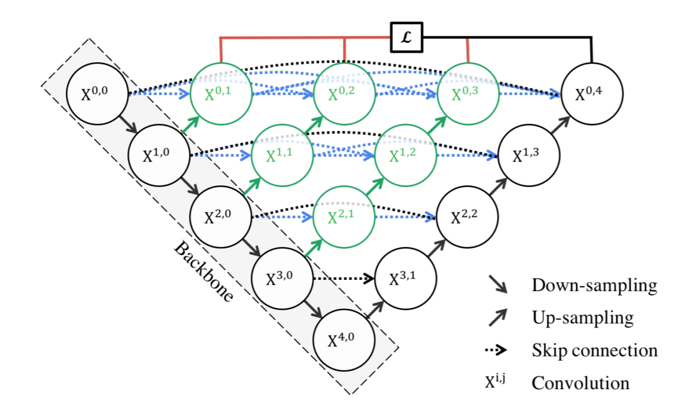

[TOC]

#  1. 任务与数据集

##  1.1. 任务

###  1.1.1. 二值语义分割

###  1.1.2. 多分类语义分割

###  1.1.3. 实例分割

##  1.2. 2D数据集

##  1.3. 3D数据集

#  2. 方法

##  2.1. 有监督方法

###  2.1.1. 基于像素位置的分割

通常，语义分割被当作批量的分类任务来处理，模型输出的是与输入图像相同规模的概率图，相同位置的‘像素点’被赋予一一对应的意义。主流做法是利用类U-net结构的2D或3D网络进行端到端的训练与预测。

###  2.1.2. 基于边界的分割

对于2D或3D分割任务，分割感兴趣目标与寻找感兴趣目标的边界没有太大区别，因此可以借助边界寻找任务来完成分割任务。

###  2.1.3. 基于方向向量场的分割方法

这种方法通常用于实例分割，这类任务需要将目标按照个体分开，而不是打上相同的标记。
模型会在语义分割的基础上再生成方向向量场来指示实例的分割。成的方向向量指向目标中心或边界。方向向量场虽然也需要监督学习，但是其数据很容易获得，根据分割标签生成就可以了。

##  2.2. 半监督方法

###  2.2.1. 对伪标签进行增强

半监督学习当中将伪标签当作正确的分割标签来进行训练。一类增强方法就是衡量伪标签的可信程度并作为损失的权重。
* 基于对抗学习
  一些文章使用GAN的判别器来衡量标签的可信程度，判别器的目的是区分真实标签和伪标签。

* 基于Dropout的方差估计
  这种方法利用Dropout的随机性质，通过多次预测并计算方差来衡量伪标签的可信程度，方差越大表示结果越不可靠应该分配较低的损失权重。

### 2.2.2. 基于自动编码器的半监督
自动编码器能够从无标签数据当中学习数据的表示。利用自动编码器的encoder作为分割网络的编码部分或者使用其产生的编码对分割模型进行增强。
《Dense biased networks with deep priori anatomy and hard region adaptation: Semi-supervised learning for fine renal artery segmentation》
##  2.3. 无监督方法

###  2.3.1. 领域自适应

领域适应方法在其他类型数据上进行训练，然后迁移到医学图像上。

###  2.3.2. 基于CycleGAN的方法

CycleGAN方法将分割为题视为一个风格变换的问题，参与训练的两类数据分别是标签与原图像。

## 2.4. 后处理方法

### 2.4.1. 条件随机场

#  3. 模型

##  3.1. Unet家族

### 3.1.1.  Unet

Unet 医学图像分割任务当中的经典模型。Unet采用下采样-跳跃链接-上采样的设计。
下采样设计能够捕获不同层次的信息，跳跃链接能够让低层次的细节信息更好的保持，而上采样过程会不断融合各个层次的信息。
可以说U-net已经不是一个特定的网络，它已经成为了医学图像分割领域的一个模型的设计范式。

### 3.1.2.  Encoder 和 Decoder Block 的改进

对编码与解码模块的改进是各种改进网络的主流方式，因为原始的U-net在这方面的设计确实过于简单。

#### 3.1.2.1.  残差块

将残差网络当中的残差块应用到U-net当中是一件相当容易的事情。

#### 3.1.2.2.  密集理解模块

将具有密集链接的模块用的做Encoder和Decoder也很容易。

#### 3.1.2.3.  Transformer

随着Transformer模型在机器视觉领域的流行，有许多研究将Transformer与U-net进行结合。
有直接将卷积操作全部替换成Transformer模型的，有些将Transformer放在U-net的最后一层。
其中，Transformer的使用方式有两种，第一种方式是将二维或三维头像展成向量序列再送入Transformer模型，第二种是使用轴向注意力模型，这种模型是修改过的适应图像数据的Self-Attention模型。

#### 3.1.2.4. 并行融合模块

并行融合模型是输入同时通过多个模型然后融合在一起。

##### 3.1.2.4.1. 金字塔池化模块

金字塔池化模型利用池化方法将特征图缩小到不同的大小，经过调整提取后再融合到一起，这些运算都是并行的。这样做的好处是加强模型对于图像尺度的学习。

##### 3.1.2.4.2. 多尺度卷积

这种方法使用多种大小的卷积核得到特征图再融合在一起，这些卷积运算也是并行计算的。

##### 3.1.2.4.3. 多层网络并行

多层网络并行是特征图并行地经过不同层数的网络再融合到一起。

### 3.1.3.  连接方式的改进

U-net当中的跳跃连接非常直观也非常简单。所以有了更加复杂的连接方式。

#### 3.1.3.1.  增加层数的跳跃连接

一些学者认为U-net当中不同层次的信息因为经过的网络层数不同，可能会导致特征融合结果不理想。
因此他们在跳跃连接的时候通过了额外的网络层，这样的网络通常是具有残差连接的网络，并且通常会使各个层次的特征经过相同数量的卷积层。

#### 3.1.3.2.  复杂链接的U-net

##### 3.1.3.2.1.  U-net++

U-net++具有非常复杂的连接设计。
首先，在同一层上的模块使用了密集链接设计，同时还在中间层也添加了上采样连接。

 

##### 3.1.3.2.2. 

 

##### 3.1.3.2.3. 密集偏置连接的U-net

 

### 3.1.4.  下采样与上采样的改进

下采样和上采样的选择都有很多种选择。下采样方式有平均池化、最大池化、步长不为1的卷积。而上采样的方式有转置卷积、插值采样、反池化等方法。
对于上采样方法，转置卷积对任意尺寸的输入没有办法适应，而插值采样和反池化方法只需要在下采样的时候进行记录就能完成对任意尺寸的输入的适应。

### 3.1.5.  特征融合方法改进

融合方法有通常有拼接以及相加两种方式对调整图进行融合。除此之外，还有使用注意力机制对特征图进行融合的方法。

##  3.2. 多分支模型

###  3.2.1. 基于多模型的分支融合模型

####  3.2.1.1. TransFuse

TransFuse使用了卷积网络和Transformer作为特征提取模块。两种模型分别产生不同尺寸的特征图，相同尺寸的两种特征图通过BiFusion模块进行融合。

##  3.3. 级联模型

##  3.4. 多尺度输入模型

多尺度输入模型是指将原始图片进行缩小然后按照尺度大小依次输入模型，通常配合金字塔模型。
使用这种方法的有PMED-net、《Region-to-boundary deep learning model with multi-scale feature fusion for medical image segmentation》

## 3.5. 神经架构搜索

基于神经架构搜索的方法搜索针对特定数据的网络架构来实现最佳性能。

## 3.6. 训练增强技术

### 3.6.1. 基于对抗学习的增强

这种方法利用GAN模型，增加一个判别器模型来辅助训练。
《Accurate pancreas segmentation using multi-level pyramidal pooling residual U-Net with adversarial mechanism》

#  4. 损失函数

##  4.1. 交叉熵家族

###  4.1.1. 交叉熵

图像分割问题实际上是批量的分类问题。
因此，广义的交叉熵损失可以写作：
$$
L= - \sum\limits_c^C\sum\limits_i^N w_i q_i^c\log p_i^c 
$$

###  4.1.2. TopK 

TopK 损失函数非常简单，在计算损失的时候保留部分较大的像素点损失值，而较小的那部分被忽略。
其可以看作是部分权重值为0的加权交叉熵损失函数。

###  4.1.3. Focal Loss

Focal Loss是改进的交叉熵损失：
$$
L= - \sum\limits_c^C\sum\limits_i^N (1-p_i^c)^\gamma q_i^c\log p_i^c 
$$
其同样可以看作加权的交叉熵损失函数。

##  4.2. Dice家族

通常，这一类的损失函数可以写作：
$$
L=1-2\frac{\sum\limits_c^C\sum\limits_i^Nw_i^cp_i^cq_i^c}{\sum\limits_c^C\sum\limits_i^Nw_i^c(p_i^c+q_i^c)}
$$

###  4.2.1. 广义Dice损失

$$
L=1-2\frac{\sum\limits_c^Cw_c\sum\limits_i^Np_i^cq_i^c}{\sum\limits_c^Cw_c\sum\limits_i^N(p_i^c+q_i^c)}
$$
当$w_c$设置为1时，广义Dice损失就退化成了一般的Dice损失。

###  4.2.2. IoU损失

$$
L=1-\frac{\sum\limits_c^C\sum\limits_i^Np_i^cq_i^c}{\sum\limits_c^C\sum\limits_i^N(p_i^c+q_i^c-p_i^cq_i^c)}
$$
并且，Dice损失和IoU损失具有如下关系：
$$
L_c=\frac{2L_d}{1+L_d}
$$

##  4.3. 基于边界的损失

###  4.3.1. Hausdorff Distance (HD) loss

## 4.4. 复合损失

DIce家族和交叉熵家族的损失函数各有优势，而且是互补的，因此通常将两种损失函数结合在一起使用。最常见的就是交叉熵加上Dice损失。

## 4.5. 讨论

对于交叉熵损失与Dice损失，可以从导数进行分析。设p是softmax输出的向量的某个值，显然$p\in (0, 1)$。对于交叉熵损失，其参与损失函数的计算的形式为：$C+\frac{1}{cn}\log p$或者是$C+\frac{1}{cn}\log (1-p)$, 有$\frac{\partial L}{\partial p}=\frac{1}{ncp}$或$\frac{\partial L}{\partial p}=-\frac{1}{nc(1-p)}$

而对于Dice损失，其参与运算的形式为$1-\frac{2p+A}{B}$, 其导数为$-\frac{2}{B}$。
也就是说，交叉熵损失对单个像素的惩罚会根据输出值而调整，而Dice损失对于所有对应输出的损失相同。这意味着Dice损失是一个从总体出发的惩罚，而交叉熵损失更关心单个像素是否准确。

#  5. 评价标准

## 5.1. 基于准确率的评价指标

## 5.2. 基于距离的评价指标
