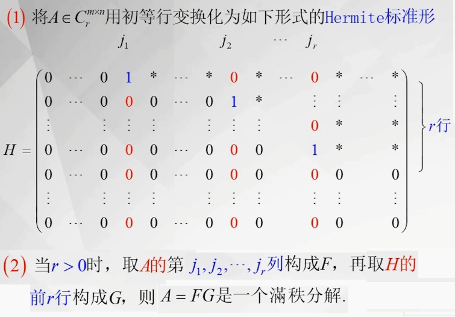
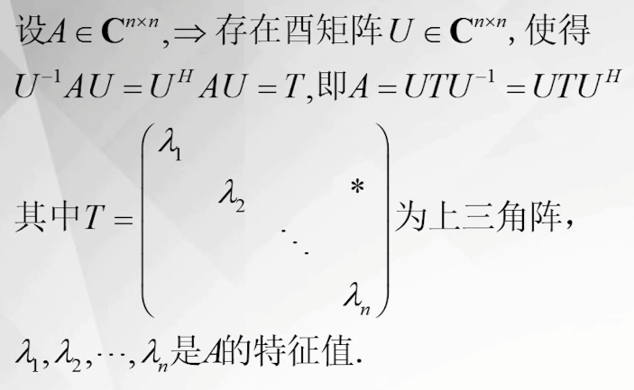
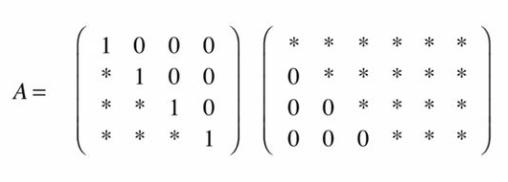

[TOC]

# 1 线性空间与线性变换
## 1.1 线性空间
###  定义 
@import "images/1.1_a.png" {width="600px"}

@import "images/1.1_b.png" {width="600px"}

### 性质
@import "images/1.1_c.png" {width="400px"}

### 子空间
将线性空间看做是集合，子空间其实就是一个子集。
以下讨论的子空间都是指线性子空间，否则会使用子集合来表示。
#### 线性子空间
@import "images/1.1_d.png" {width="600px"}

线性空间$V$的非空子集$S$构成$V$的子空间的充要条件是:$\forall X,Y \in S ;\lambda ,\mu \in F,\lambda X+\mu Y \in S$

#### 不变子空间
@import "images/1.1_e.png" {width="650px"}

#### 子空间的交于和
@import "images/1.1_f.png" {width="650px"}

子空间的交与集合的交一致。
子空间的交与和的结果还是子空间。
关于子空间运算维数有以下定理：
@import "images/1.1_g.png" {width="650px"}

## 1.2 线性变换

设$\mathscr{A}$是线性空间$V$上的一个变换，如果其满足：
(1):$\mathscr{A}(X+Y)=\mathscr{A}(X)+\mathscr{A}(Y)$
(2):$\mathscr{A}(kX)=k\mathscr{A}(X)$
就称$\mathscr{A}$是一个线性变换。

### 线性变换的性质
- $\mathscr{A}(0)=0$
- $\mathscr{A}(-X)=-\mathscr{A}(X)$
- 若$Y=\sum k_iX_i$，则$\mathscr{A}(Y)=\sum k_i\mathscr{A}(X_i)$
- 若$X_1,X_2,...,X_r$线性相关，则$\mathscr{A}(X_1),\mathscr{A}(X_2),...,\mathscr{A}(X_r)$也线性相关。其逆定理一般不成立。
- 线性变换的和、积、数乘都是线性变换
- 若两个线性变换的乘积为单位变换，则这两个线性变换互为逆变换。
- 线性变换的乘积一般不满足交换律

### 线性变换的矩阵表示

@import "images/1.2_a.png" {width="600px"}

@import "images/1.2_b.png" {width="600px"}

有了矩阵$A$，线性变换就可以表示成：
$$\mathscr{A}(X)=AX$$

对于一个线性变换，其在两组基底下的矩阵分别是$A,B$，从第一个基底到第二个基底的过渡矩阵为$C$，则有：
$$B=C^{-1}AC$$

### 正交变换

@import "images/1.2_c.png" {width="600px"}

@import "images/1.2_d.png" {width="600px"}

# 2 内积空间
## 2.1 实线性空间中引入内积
### 定义
@import "images/2_a.png" {width="600px"}

### 欧式空间的性质

@import "images/2_b.png" {width="600px"}

## 2.2 在复线性空间引入内积
### 定义

@import "images/2.2_a.png" {width="600px"}

### 酉空间的性质

@import "images/2.2_b.png" {width="600px"}

# 3 范数
## 3.1 向量范数
### 定义
@import "images/3.1_a.png" {width="600px"}

### 性质
@import "images/3.1_b.png" {width="600px"}

### 常用范数

- 1-范数
  $\parallel x\parallel _1=\sum \limits_{i=1}^n |x_i|$
  也就是向量各个元素的绝对值之和。
- 2-范数
  $\parallel x\parallel _2=\sqrt{\sum\limits_{i=1}^nx_i^2}$
- $\infty$-范数
  $\parallel x\parallel _\infty= \max\limits_{i}|x_i|$

以上三种常用范数都可以统一定义为p-范数

$\parallel x\parallel_p=(\sum\limits_{i=1}^n |x_i|^p)^\frac{1}{p}$

### 范数等价
@import "images/3.1_c.png" {width="600px"}

## 3.2 矩阵范数
### 定义
@import "images/3.2_a.png" {width="600px"}
@import "images/3.2_b.png" {width="600px"}

### 由向量范数导出的矩阵范数
矩阵范数的导出使用的是$\parallel A\parallel=\max\limits_{\parallel x\parallel =1}\parallel Ax\parallel$

- 1-范数
  由向量的1-范数导出
  $\parallel A\parallel _1=\max \limits_{j}\sum\limits_{i=1}^m|a_{ij}|$
  也就是矩阵列向量1-范数的最大值
- 2-范数
  由向量的2-范数导出
  $\parallel A \parallel _2=\sigma _1$
  也就是矩阵的最大奇异值
- $\infty$-范数
  $\parallel A\parallel _\infty=\max \limits_{i}\sum\limits_{j=1}^m|a_{ij}|$
  也就是矩阵行向量的1-范数的最大值

### 其他矩阵范数
如果把矩阵看做是特殊的向量，那就可以把范数同样用在矩阵上。
Frobenius范数就是把矩阵写成向量后求的向量2-范数。

$\parallel A \parallel _F=\sqrt{\sum\limits_{i=1}^m \sum\limits_{j=1}^n a_{ij}^2}$

Frobenius范数与向量2-范数也是相容的。

$\parallel A \parallel_{m_1}=\sum\limits_{i=1}^m\sum\limits_{j=1}^n|a_{ij}|$

这个范数被称为$m_1$范数，其与向量的1-范数相容。

$\parallel A \parallel _M=\max(m,n)\max\limits_{i,j}|a_{ij}|$

这个范数被称为$M$范数或最大范数，其与向量的1-范数、2-范数和$\infty$范数相容。

$\parallel A \parallel _G=\sqrt{mn}\max\limits_{i,j}|a_{ij}|$

这个范数被称为$G$范数或几何范数，其与向量的2-范数相容。
### 谱半径

矩阵的谱半径其实就是矩阵最大绝对特征值，记为$\rho(A)=\max\limits_k|\lambda_k|$

谱半径有以下简单性质：
- $\rho(A)=\rho(A^T)=\rho(A^H)$
- $\rho(A^k)=[\rho(A)]^k$
- 当$A$是正规矩阵时，$\rho(A)=\parallel A \parallel_2$
  
谱半径是矩阵范数的下确界，即$\rho(A)\le \parallel A\parallel$

另一方面，对于某种确定的范数，存在常数$\epsilon$使得$\parallel A\parallel \le \rho(A)+\epsilon$
### 矩阵范数的酉不变性

若$U,V$是两个酉矩阵，则有：
$\parallel UA\parallel_F=\parallel AV\parallel_F=\parallel UAV\parallel_F=\parallel A\parallel_F$
$\parallel UA \parallel _2=\parallel AV\parallel _2=\parallel UAV\parallel _2=\parallel A\parallel _2$

# 3 矩阵分析
## 3.1 向量的极限

对于向量序列$X^{(t)}=[x_1(t),x_2(t),...,x_n(t)]$取得有极限的条件是向量的每一个分量都有极限。

记作：$\lim\limits_{k\to \infty}X^{(t)}=X$

## 3.2 向量级数

对于向量$Y=X^{(1)}+X^{(2)}+...+X^{(t)}+...$如果存在极限则说向量级数$X^{(1)}+X^{(2)}+...+X^{(t)}+...$收敛，否则为发散。

## 3.3 矩阵的极限

与向量的极限相似，当矩阵中的每一个元素都存在极限时，矩阵的极限存在。

存在极限的矩阵满足极限加法、极限数乘、极限矩阵乘法。

当逆矩阵存在时，逆矩阵也收敛（极限存在）。

## 3.4 矩阵级数

与向量级数相似，定义无穷多个矩阵的和为矩阵级数，同样有收敛发生的分别。

@import "images/4_d.png" {width="600px"}

## 3.5 函数矩阵

当矩阵的每一个元素都是一个变量$x$的函数时，这样的矩阵被称为函数矩阵。

普通矩阵是特殊的函数矩阵，其每一个元素被看做是常数函数。

当每一个元素的极限存在时，函数矩阵极限存在。

函数矩阵与矩阵序列基本是一致的。

矩阵函数被记为：$A[x]$

## 3.6 矩阵函数的微积分

矩阵函数的导数就是元素导数组成的矩阵。

满足以下求导法则：
- $(A[x]+B[x])'=A'[x]+B'[x]$
- $(kA[x])'=kA'[x]$        ($k$为常数)
- $(KA[x])'=KA'[x]$ ($K$为常数矩阵)
- $(A[x]K)'=A'[x]K$ ($K$为常数矩阵)
- $(A[x]B[x])'=A'[x]B[x]+A[x]B'[x]$
- $(f(x)A[x])'=f'(x)A[x]+f(x)A'[x]$

矩阵函数的积分就是元素积分组成的矩阵。

# 4 矩阵函数
函数矩阵是函数组成的矩阵，而矩阵函数是以矩阵为自变量的函数。

矩阵函数可以用绝对收敛的级数来定义，比如：$e^A=\sum\frac{A^n}{n!}$

下面的一般的定义：
## 定义
@import "images/4_a.png" {width="600px"}

对于给定的$n$阶矩阵$A$和解析函数$f(x)$，求$f(A)$的步骤如下。

- 1 求出矩阵$A$的特征值$\lambda_1,\lambda_2,...,\lambda_n$
- 2 假设$g(x)=a_0+a_1x+a_2x^+...+a_nx^n$
- 3 求解方程组$f(\lambda_i)=g(\lambda_i)$求出多项式系数，如果有重复的特征值用$f'(\lambda_i)=g'(\lambda_i),f''(\lambda_i)=g''(\lambda_i),...$代替。
- 4 计算$f(A)=g(A)=a_0I+a_1A+a_2A^2+...+a_nA^n$

## 性质
@import "images/4_b.png" {width="600px"}

@import "images/4_c.png" {width="600px"}

## 矩阵函数的幂级数表示

@import "images/4_e.png" {width="600px"}

## 微分方程
微分方程是解函数向量的一类方程。
### 一阶常系数线性齐次微分方程
$\dot{X}(t)=AX(t)$

其解为$X(t)=e^{At}K$

其中$K$为任意的场向量。

@import "images/4_f.png" {width="600px"}

满足条件$X(0)=X_0$的特解为$X(t)=e^{At}X_0$

### 一阶常系数线性非齐次微分方程

$\dot{X}(t)=AX(t)+Bu(t)$

$\frac{d}{dt}X(t)-AX(t)=Bu(t)$

两边左乘$e^{-At}$

$e^{-At}\frac{d}{dt}X(t)-e^{-At}AX(t)=e^{-At}Bu(t)$

$\frac{d}{dt}[e^{-At}X(t)]=e^{-At}Bu(t)$

$e^{-At}X(t)=\int e^{-At}Bu(t)dt$

应用上初始条件$X(0)=X_0$

$e^{-At}X(t)=X_0+\int_0^t e^{-A\tau}Bu(\tau)d\tau$

$X(t)=e^{At}X_0+e^{At}\int_0^t e^{-A\tau}Bu(\tau)d\tau$

### 一阶线性齐次微分方程

如果微分方程的系数不是常矩阵而是函数矩阵，其解就会比常系数的方程负责很多。

可以看到，常系数其实就是特殊的函数矩阵，所以解应该包含常系数的解。

对于一阶线性齐次微分方程

$\dot{X}(t)=A(t)X(t)$
$X(t_0)=X_0$

我们用状态转移矩阵来描述方程的解：
$X(t)=\Phi(t,t_0)X(t_0)$

其中$\Phi(t,t_0)$满足$\dot{\Phi}(t,t_0)=A(x)\Phi(t,t_0)$，并且$\Phi(t_0,t_0)=I$且$\Phi(t,t_0)$是非奇异的。

可以验证：$\frac{d}{dt}X(t)=\frac{d}{dt}[\Phi(t,t_0)X(t_0)]=\dot{\Phi}(t,t_0)X(t_0)=A(x)\Phi(t,t_0)X(t_0)=A(t)X(t)$

状态转移矩阵有以下一些性质：

- $\Phi(t_1,t_0)\Phi(t_2,t_1)=\Phi(t_2,t_0)$
- $\Phi(t_1,t_0)=\Phi^{-1}(t_0,t_1)$

那如何求状态转移矩阵呢？

分两种情况：

1 当$A(t)$和$\int_{t_0}^tA(\tau)d\tau$是可以交换的时候，也就是矩阵$A$是常数矩阵或者说对角矩阵的时候，$\Phi(t,t_0)=e^{\int_{t_0}^tA(\tau)d\tau}$

2 普通函数矩阵的情况，$\Phi(t,t_0)=I+\int_{t_0}^tA(\tau)d\tau+\int_{t_0}^tA(\tau_1)[\int_{t_0}^{\tau_1}A(\tau_2)d\tau_2] d\tau_1+\int_{t_0}^tA(\tau_1)[\int_{t_0}^{\tau_1}A(\tau_2)[\int_{t_0}^{\tau_2}A(\tau_3)d\tau_3]d\tau_2] d\tau_1 + ...$

### 一阶线性非齐次微分方程

对于非齐次的微分方程:

$\dot{X}(t)=A(t)X(t)+B(t)u(t)$

从常系数的情况来看，非齐次方程的解应该也是对应齐次方程的解加上特解。

假设$X(t)=\Phi(t,t_0)X(t_0)+Y(t)$

$\frac{d}{dt}X(t)=\dot{\Phi}(t,t_0)X(t_0)+\frac{d}{dt}Y(t)=A(x)\Phi(t,t_0)X(t_0)+A(t)Y(t)-A(t)Y(t)+\frac{d}{dt}Y(t)=A(t)X(t)+\frac{d}{dt}Y(t)-A(t)Y(t)$

对比后得到$\dot{Y}(x)=A(t)Y(t)+B(t)u(t)$

说明方程$Y(x)$也是这个方程的解，所以$Y(x)$是方程的特解。

$\dot{Y}(x)-A(t)Y(t)=\dot{Y}(x)-\dot{\Phi}(t,t_0)\Phi^{-1}(t,t_0)Y(x)$

由于$\dot{Y}=\dot{(IY)}=\dot{(\Phi\Phi^{-1}Y)}=\dot{\Phi}\Phi^{-1}Y+\Phi\dot{\Phi}^{-1}Y+\Phi\Phi^{-1}\dot{Y}$

有$-\dot{\Phi}\Phi^{-1}Y=\Phi\dot{\Phi}^{-1}Y$

所以$\dot{Y}(x)-\dot{\Phi}(t,t_0)\Phi^{-1}(t,t_0)Y(x)=\dot{Y}(x)+\Phi(t,t_0)\dot{\Phi}^{-1}(t,t_0)Y(t)=\Phi(t,t_0)\frac{d}{dt}[\Phi^{-1}(t,t_0)Y(x)]=B(t)u(t)$

故$\Phi^{-1}(t,t_0)Y(x)=\int_{t_0}^t\Phi^{-1}(\tau,t_0)B(\tau)u(\tau)d\tau + C$

由于$X(t_0)=\Phi(t_0,t_0)X(t_0)+Y(t_0)=X(t_0)+Y(t_0)$

故$Y(t_0)=0$

故$C=0$

综上所述$X(t)=\Phi(t,t_0)X(t_0)+\Phi(t,t_0)\int_{t_0}^t\Phi^{-1}(\tau,t_0)B(\tau)u(\tau)d\tau$

也就是说，我们需要先把这个微分方程当做齐次的来解，求得状态转移矩阵之后再计算出非齐次方程的特解。

### Riccati方程

对于方程：

$\dot{P}(x)=A(t)P(t)+P(t)B(t)+P(t)C(t)P(t)+D(t)$

$P(t_0)=E$

以上矩阵都是n阶函数矩阵，注意，这里的E不再表示单位矩阵，而是一个初始状态。

将以上方程转化为下面的一阶线性齐次方程：

@import "images/4_g.png" {width=400}

求出$W(t)$之后，就可以将$P(x)$表达成$Y(t)X^{-1}(t)$

这样我们就只需要解一个$2n\times 2n$的状态转移矩阵。

如果将状态转移矩阵分块成4个$n\times n$的子块，分别为:$Q_{11},Q_{12},Q_{21},Q_{22}$

那么$P(t)=[Q_{21}(t,t_0)+Q_{22}(t,t_0)E][Q_{11}(t,t_0)+Q_{12}(t,t_0)E]^{-1}$

# 5 广义逆矩阵

逆矩阵存在的条件是非奇异的方阵，而大多数矩阵都不符合这个条件。

## 满秩长矩阵的右逆和左逆

对于一个$m\times n(m  <  n)$的矩阵A，如果$rank(A)=m$,那么矩阵的逆可以定义为以下方程的解：

$AX=I$

$X$是$n\times m$的满秩矩阵。

因为$AA^T(AA^T)^{-1}=I$

所以$A_R^{-1}=A^T(AA^T)^{-1}$

同理，可以得到$n\times m(m>n)$的矩阵的左逆：

$A_L^{-1}=(A^TA)^{-1}A^T$

矩阵的左逆和右逆不同时存在，只有当矩阵为方阵的时候，左逆和右逆都存在且等于方阵的逆。

当然，上面的方程有无穷多的解，因此需要一个更一般的表达式。

左逆：$A_R^{-1}=VA^T(AVA^T)^{-1}$

右逆：$A_L^{-1}=(A^TUA)^{-1}A^TU$

其中的$V,U$是使式中矩阵逆存在的任意n阶方阵。

## $A^-$广义逆

@import "images/5_a.png" {width=600}

对于满秩矩阵来说，g逆就是左逆或者右逆。

而对于非满秩矩阵来说，矩阵$A$可以分解成$m\times r$ 和$r\times n$的矩阵的乘积。

$A=CD$

因为$C,D$都是满秩的，因此存在左逆或者右逆。

那么$A^-=D_R^{-1}C_L^{-1}$

因为$AA^-A=CDD_R^{-1}C_L^{-1}CD=CD=A$

### $A^-$的性质

广义逆的性质有：

- $(A^-)^T=(A^T)^-$
但是因为g逆并不是唯一的，所以说这里的表述是A的g逆的转置是A的转置的一个g逆。
- $A(A^TA)^-A^TA=A$
  也就是说$(A^TA)^-A^T$是$A$的一个g逆。
- $rank(A^-)\geq rank(A)$
- 等式$BA^-A=B$成立的充要条件是$\exist D:B=DA$，等式$AA^-B$存在的充要条件是$\exist D:B=AD$
  
### $A^-$的计算方法
- 矩阵分解法
  先把矩阵进行满秩分解，然后求分解后矩阵的左逆和右逆得到$A$的g逆
  $A=CD$
  $A^-=D_R^{-1}C_L^{-1}$
  矩阵的一个分解法为利用初等变换将矩阵化为阶梯形式的$\tilde{A}$
  $\tilde{A}=PAQ$
  通过对$\tilde{A}$进行分解来得到$A$的分解。
  $$C=P^{-1}\left (\begin{array}{c}
  \tilde{A}_r \\
  \hline 0
  \end{array}\right );D=\left ( \begin{array}{c|c}
    I&0
  \end{array} \right )Q^{-1}$$
- 初等变化法
  同样，先将矩阵用初等变换将矩阵化为$\tilde{A}$，不过这一次需要化成具有rxr之阵的形式。
  $$\tilde{A}=\left (\begin{array}{c|c}
    \tilde{A}_{r}&0\\
    \hline 0&0
  \end{array} \right )$$
  这时的$\tilde{A}_r$显然是一个满秩的方阵，显然对于这样的方阵是可以求逆的。
  显然有：
  $$\tilde{A}^-=\left (\begin{array}{c|c}
    \tilde{A}_{r}^{-1}&0\\
    \hline 0&0
  \end{array} \right )$$
  那么原矩阵的逆可以写成$A^-=(P^{-1}\tilde{A}Q^{-1})^-=Q\tilde{A}^-P$
  特别的，如果将矩阵$\tilde{A}_r$化成单位矩阵，就可以少进行一步求逆矩阵，而且也更方便计算。
  更进一步的，$\tilde{A}$只需要是有r阶子式就行其他区域不要求为0。
- 初等行变化法
  将矩阵通过行变换得到
  $$\tilde{A}=\left (\begin{array}{}
    C\\
    \hline B
  \end{array} \right )$$
  其中C是满秩序的$r\times n$矩阵，也就是$\tilde{A}=PA$

  $\tilde{A}$的一个逆是：
  $$\tilde{A}^-=\left (\begin{array}{c|c}
    C^-_R&0
  \end{array} \right )$$

  则$A^-=(P^{-1}\tilde{A})^-=\tilde{A}^-P$
- 初等列变换
  与行变换的做法相似，先通过列变换得到
  $$\tilde{A}=\left (\begin{array}{c|c}
    C&B
  \end{array} \right )$$
  C为满秩序$m\times r$矩阵，有$\tilde{A}=AQ$，C可以求左逆。
  $$\tilde{A}^-=\left (\begin{array}{}
    C^-_L\\
    \hline 0
  \end{array} \right )$$
  则$A^-=(\tilde{A}Q^{-1})^-=Q\tilde{A}^-$

### 广义逆矩阵$A^-$的应用
#### 求方程组的解

对于线性方程组$AX=B$来说。

如果方程组有解，就是说这样的$X$是存在的，也就是说存在矩阵（向量）$X$使$B=AX$，也就等价于$AA^-B=B$。

那么$X=A^-B$一定是方程组的一个特解。

根据解的结构，如果特解再加上$AX=0$的通解就得到了$AX=B$的通解。

对于g逆来说，有$AA^-A=A$即$A(I-A^-A)=0$，那么$\forall C:A[(I-A^-A)C]=0$

下面说明$(I-A^-A)C$是齐次方程组的全部解，显然$A$的所有行向量都和$X$正交，因为$rank(A)=r$，所以有r个线性无关的向量，这些向量显然可以组成r阶子空间$\mathcal{G}$的基并且可以正交化为$e_1,e_2,...,e_r$。

那么一定有$n-r$个正交向量$e_{r+1},e_{r+2},...,e_n$使得$e_1,e_2,...,e_n$为$n$维向量空间的正交基。$X$可以表达为正交基的线型组合，而且$e_1,e_2,...,e_r$显然为0，因为子空间$\mathcal{G}$中不存在与$e_1,e_2,...,e_r$都正交的非0向量，所以$X\in \mathcal{G}^T$并且$\mathcal{G}^T$中任意向量都是方程的解。

对于$(I-A^-A)C$是$(I-A^-A)$的列向量的线性组合，取$A^-=Q\tilde{A}^-AQ^{-1}$，这里将$A$变化成类似单位矩阵的形式。这时
$$\tilde{A}^-A=diag(\underbrace{1,1,\cdots,1}_r,0,0,\cdots,0)$$
因此$rank(I-A^-A)=rank(Q(I-\tilde{A}^-A)Q^{-1})=rank(I-\tilde{A}^-A)=n-r$
又因为$(I-A^-A)$的列向量与子空间$\mathcal{G}$也是正交的，因此由$(I-A^-A)$的列向量为基形成的子空间也是$\mathcal{G}$的正交补。

由于子空间的正交补是唯一的，所以$(I-A^-A)C$就是齐次方程的通解。

回到线性方程组$AX=B$，其通解为：$X=A^-B+(I-A^-A)C$，$C$为任意$n$维向量。

这说明，对于任意有解的线性方程组都有了统一的方法进行求解。

##### 最小范数解

最小范数解是指满足不等式$\parallel GB\parallel \le \parallel X\parallel$的$GB$。

$G$是$A$的g逆，也就是说希望找到一个广义逆使得上面的特解项的（2-）范数最小，也就是最接近0向量。

不等式成立的充要条件是：$(GA)^T=GA$

值得注意的是，这样的g逆并不是唯一的，把这样的g逆称为**最小范数g逆**，记为$A^-_m$

虽然最小范数g逆不是惟一的，但是最小范数特解$GB$却是唯一的。

一个最小范数g逆为:$A_m^-=A^T(AA^T)^-$，因为$A_m^-A=A^T(A^T)^-A^-A=A^T(A^-)^TA^-A=(A^-A)^TA^-A$，这显然是一个对称矩阵，对行满秩来说这就是其右逆。

最小范数g逆的一般表达式为$A_m^-=A^T(AA^T)^-+U(I-AA^T(AA^T)^-)$，$U$是具有适当形状的任意矩阵。

#### 不相容方程组的最小二乘解

如果线性方程组$AX=B$没有解，我们转而研究其近似解：$X=\argmin\limits_X\parallel AX-B\parallel_2$

$G$为A的g逆，则$GB$为其最小二乘近似解的充要条件是$(AG)^T=AG$

这样的g逆被称为**最小二乘解g逆**

最小二乘解的一般表达式为$X=GB+(I-GA)C$

需要注意的是，最小误差是唯一的，但是最小二乘解不唯一。

$G=(A^TA)^-A^T$是一个最小二乘g逆，对列满秩矩阵来说就是左逆。

最小二乘g逆的一般表达式为$G=(A^TA)^-A^T+(I-(A^TA)^-A^TA)U$

## $A^+$广义逆

对于矩阵的g逆来说，g逆解决了很多问题。

$A^+$属于g逆，是g逆的特定子集。

很多时候，我们只需要一个顺便的g逆或者具有某种条件的顺便一个g逆就能解决问题。

那也许有这样的g逆：满足大多数问题需要的条件、方便计算

所以就有了Moore-Penrose定义的广义逆

@import "images/5_b.png" {width=600}

广义逆$A^+$的存在性：
- 行满秩矩阵：显然右逆就符合条件
- 列满秩矩阵：显然左逆符合条件
- 一般非满秩矩阵：满秩分解法求得的矩阵符合条件
广义逆的唯一性：
设$G_1,G_2$是两个A的$A^+$广义逆
$$\begin{aligned}
  G_1&=G_1AG_1\\
     &=G_1(AG_1)^T\\
     &=G_1G_1^TA^T\\
     &=G_1G_1^T(AG_2A)^T\\
     &=G_1G_1^TA^TG_2^TA^T\\
     &=G_1AG_1AG_2\\
     &=G_1AG_2\\
     &=A^TG_1^TG_2\\
     &=(AG_2A)^TG_1^TG_2\\
     &=A^TG2^TA^TG_1^TG_2\\
     &=G_2AG_1AG_2\\
     &=G_2AG_2\\
     &=G_2
\end{aligned}$$

### $A^+$广义逆的性质

显然，$A^+$广义逆属于g逆就有g逆的性质。

除此之外还有：

- $A^+$是反射g逆，$(A^+)^+=A$
- $A^+$是最小范数g逆
- $A^+$是最小二乘g逆
### $A^+$的求法
- 对于满秩方阵：略
- 对角方阵：非零元素取倒数
- 行满秩矩阵：右逆
- 列满秩矩阵：左逆
- 一般矩阵：1：满秩分解法，2：初等变换法，但$\tilde{A}$除去r阶子阵外都为0，并且$P,Q$得是正交矩阵，3：奇异值分解法：若$A=U\Sigma V^*$，则$A^+=V\Sigma^+U^*$

# 6 矩阵分解
## 满秩分解
设$rank(A)=r,A\in C^{m\times n}$，则存在列满秩矩阵$F\in C^{m\times r}$和行满秩矩阵$G\in C^{r\times n}$使得$A=FG$

这样的分解方法叫满秩分解，满秩分解并不是唯一的。

使用初等变换求解满秩分解问题。

$$\left(\begin{array}{}
  A&I_m\\
  I_n&0
\end{array}\right)\xrightarrow{初等变换}\left(\begin{array}{}
  \left(\begin{array}{}
  I_r&0\\
  0&0
\end{array}\right)&S\\
T&0
\end{array}\right)$$

$$A=S^{-1}\left(\begin{array}{}
  I_r&0\\
  0&0
\end{array}\right)T^{-1}$$

$$F=S^{-1}\left(\begin{array}{}
  I_r\\
  0
\end{array}\right),G=\left(\begin{array}{}
  I_r&0
\end{array}\right)T^{-1}$$

还有更简单的求法。

## Jordan标准型分解
见[Jordan标准型](#8-jordan标准型)
## Schur分解

## 三角（LU）分解

回顾对于线性方程组$AX=b$的求解，使用的最一般的方法就是将增广矩阵$(A|b)$化为阶梯矩阵来求解。

LU分解是将矩阵（方阵）分解为一个下三角矩阵$L$和一个上三角矩阵$U$的乘积，即$A=LU$

假设$A$是$n\times n$的满秩矩阵，由以下方法可以得到一个上三角行列式：

1 对除了第一行以外的行$r_i(i\ne 1)$减去$a_{i1}$倍的$r_1$，这样第一列除了第一行外都是0
2 去除去第一行和第一列的子阵重复第一步，直到矩阵为一阶方阵

从上面的操作看来，都是把上面的行加到下面的行。

记得到的上三角矩阵为$\tilde{A}$则有$\tilde{A}=P_{n(n-1)}P_{n^2-n-1}\cdots P_2P_1A$

$P=P_{n(n-1)}P_{n^2-n-1}\cdots P_2P_1=P_{n(n-1)}P_{n^2-n-1}\cdots P_2P_1I$是一个下三角矩阵

则有$A=P^{-1}\tilde{A}$，下三角矩阵的逆还是下三角矩阵，这样就把$A$分解成了下三角矩阵和上三角矩阵的积。

当然，这样的方法并不是百分百能够成功的，比如对矩阵$\bigl(\begin{smallmatrix}0&0&1\\1&0&0\\0&1&0\end{smallmatrix}\bigl)$来说就没办法使用这种方法。

因此，LU分解存在一定的条件限制有以下三点：
- 1 矩阵必须是方阵
- 2 矩阵是非奇异的
- 3 高斯消元法中没有行交换操作
  
### LU分解的应用

考虑线性方程组$Ax=b$，如果$A=LU$，则有$LUx=L(Ux)=b$

可以看到，$Ux$是向量，可以先求解方程$Ly=b$再求解$Ux=y$

因为两个矩阵都是三角矩阵，所以求解是非常容易的。
  
### PLU分解

在LU分解当中，因为对行变换做出了限制，所以应用范围会变的很小。

如果我们先对源矩阵进行行变换变换成可以分解成LU的形式，就会有：

$$PA=LU$$

其中$P$代表对$A$的行变换

在原来的方法当中是利用增广矩阵$(A|I)$来进行变换，现在可以变换为使用增广矩阵$(A|I|I)$来记录。

第一个$I$只记录行加法变换，第二个只记录行交换变换，最终得到$(U|L^{-1}|P)$

最终$A=P^{-1}LU$

### 非方阵的LU分解

对于非方阵矩阵也可以进行LU分解，不过不能保持三角矩阵。

考虑$m\times n(m< n)$ 的矩阵$A,rank(A)=m$，如果对$A$使用LU分解方法，依然会得到mxm的下三角矩阵$L$，但是$U$会变成$m\times n$的阶梯矩阵

如果需要交换，那么PLU的方法依然适用。

对于列满秩长矩阵，将上面的行初等变换换成列初等变换也能得到类似的结果。

### 非满秩矩阵的分解

既然已经放开了对U的要求，更进一步的非满秩矩阵也可以这样分解，只不过分解后的矩阵U也是不满秩的阶梯矩阵。

### LDU分解

如果同时对矩阵进行行列初等变换，就会有$\tilde{A}=PAQ$

如果行变换和列变换都只做将低位行（列）加到高位行（列）这样的操作，那么$P,Q$也会是下（上）三角矩阵。

因此有了$A=LDU$的分解方法，$D$是一个对角矩阵。

显然，这样的分解方法对非方阵、非满秩矩阵也是可行的。

## QR分解

QR分解是将矩阵分解成一个单位正交矩阵$Q$和一个上三角矩阵的积

这样的分解其实很好理解。

考虑一个满秩方阵$A$，由施密特正交化法可以将矩阵化为单位正交矩阵$Q$

并且会有以下关系：
假设$A$的列向量为$\alpha_1,\alpha_2,...,\alpha_n$，$Q$的列向量为$\beta_1,\beta_2,...,\beta_n$
则：
$\beta_1=a_{11}\alpha_1\\ \beta_2=a_{21}\alpha_1+a_{22}\alpha_2\\ \cdots \\ \beta_n=a_{n1}\alpha_1+a_{n2}\alpha_2+...+a_{nn}\alpha_n$

也就是$Q=AC$，其中

$$C=\left(\begin{matrix}
a_{11}&a_{21}&\cdots &a_{n1}\\
0&a_{22}&\cdots &a_{n2}\\
\vdots&\vdots&\ddots&\vdots\\  
0&0&\cdot&a_{nn}
\end{matrix} \right)$$

令$R=C^{-1}$就得到了$A=QR$

这样的方法是有条件的，很显然$A$应该是满秩方阵。

但其实不满秩的方阵，甚至不是方阵也可以使用施密特正交化方法，但是无法得到这样的形式。

对于一个$m\times n$的矩阵$A,rank(A)=r$，我们同样可以找到一组标准正交基来表示矩阵$A$的列向量或者行向量，但这时候求出的系数不一定能够形成三角矩阵。

但是，如果是$rank(A)=\min(m,n)$我们可以求出具有三角子阵的矩阵$R$，就比如列满秩矩阵可以分解为$A=Q\left(\begin{array}{}R \\ 0\end{array}\right)$。而$Q$也不必是正交矩阵，反正就算补全成方阵后面的列向量也不会参与运算，这样又回到了$A=QR$的形式。
### Householder变换方法

对于一个给定的满秩方阵$A$可以通过Householder变换得到QR分解。

Householder变换可以将一个向量变换成另一个指定的向量，如果用Householder变换将$A$的列向量变换到$Q$的列向量，就可以得到矩阵$R$。

我们假设$Q=I_n$

同样假设$A$的列向量为$\alpha_1,\alpha_2,...,\alpha_n$，$Q$的列向量为$\beta_1,\beta_2,...,\beta_n$

由于$Q$的列向量是单位向量，而Householder变换是正交变换，所以应该做的是把$\alpha_1$变换成$\parallel\alpha_1\parallel_2\beta_1$

所以$w=\frac{\alpha_1-\parallel\alpha_1\parallel_2\beta_1}{\parallel\alpha_1-\parallel\alpha_1\parallel_2\beta_1\parallel_2}$

$H_1=I-ww^T=I-\frac{(\alpha_1-\parallel\alpha_1\parallel_2\beta_1)(\alpha_1-\parallel\alpha_1\parallel_2\beta_1)^T}{(\alpha_1-\parallel\alpha_1\parallel_2\beta_1)^T(\alpha_1-\parallel\alpha_1\parallel_2\beta_1)}$

对整个$A$进行Householder变换就得到了:

$H_1A=(\parallel\alpha_1\parallel_2\beta_1,*,...,*)=\left(\begin{array}{}\parallel\alpha_1\parallel_2&*&\cdots&*\\ 0&&&\\\vdots&&A'&\\0&&&\end{array}\right)$

由于$A$是满秩矩阵，因此$A'$也是满秩的，而$Q$中对应的子阵是$I_{n-1}$因此可以对$A'$和$I_{n-1}$实行上面的变换，并且一直重复这个过程。

则$H_t=\left(\begin{array}{}
  I_{t-1}&0\\
  0&H
\end{array}\right)$

最终得到$H_n...H_1A=R$

令$Q=H_1^TH_2^T\cdots H_n^T$就完成了QR分解。

## 奇异值分解

奇异值分解是推广到一般矩阵的矩阵对角化。

**定义**：$A,B\in C^{m\times n}$，若存在两个酉矩阵$U\in C^{m\times m},V\in C^{n\times n}$使得$A=U^HBV$则称$A,B$酉等价。

**定义**：$A\in C^{m\times n}$，$A^HA$的特征值为$\lambda_1\ge\lambda_2\ge\cdots\ge\lambda_r>\lambda_{r+1}=\cdots=\lambda_n=0$，则$\sigma_i=\sqrt{\lambda_i},(i=1,2,3,\cdots,r)$称为矩阵$A$的奇异值。

特征值是方阵的概念，而奇异值是一般矩阵的概念，当$A$是正定的Hermite矩阵时，两者是相同。

酉等价的矩阵有相同奇异值。

**定理**：若$A\in C^{m\times n}$则存在两个酉矩阵$U\in C^{m\times m},V\in C^{n\times n}$使得
$$A=U\left(\begin{array}{}
  \Sigma&0\\
  0&0
\end{array}{}\right)V^H$$
其中，$\Sigma=diag(\sigma_1,\sigma_2,\cdots,\sigma_r)$

这个过程叫做**奇异值分解**（Singular Value Decomposition）。

奇异值分解计算步骤：
- 1 求出$A^HA$的特征值和特征向量
- 2 用特征值求出奇异值组成矩阵$\Sigma$并将特征向量化为酉矩阵$V$
- 3 分块$V=(V_1,V_2),V\in C^{n\times r}$，令$U_1=AV_1\Sigma^{-1}$，然后将$U_1$补全为酉矩阵$U$

# 7 矩阵的特征值理论
## 定义
矩阵的特征值是使方程$Ax=\lambda x$成立的$\lambda$的值，矩阵的特征向量就是使方程成立的向量$x$。

矩阵的最小多项式为$det(\lambda I-A)$

最小多项式的解都是矩阵的特征值，特征值$\lambda_i$对应的齐次方程$(\lambda_iI-A)x=0$的非零解就是对应$\lambda_i$的特征向量。

## 性质
记$n$阶方阵$A$的特征值为$\lambda_1,\lambda_2,\cdots,\lambda_n$

- $tr(A)=\sum\limits_{i=1}^n\lambda_i$
- $det(A)=\prod\limits_{i=1}^n\lambda_i$
- $A,A^T$的特征值相同
- $A^H$(共轭转置)的特征值为$\bar{\lambda}_1,\bar{\lambda}_2,\cdots,\bar{\lambda}_n$
- $f$为一多项式，则$f(A)$的特征值为$f(\lambda_1),f(\lambda_2),\cdots,f(\lambda_n)$

# 8 Jordan标准型

$\lambda$-矩阵是指矩阵的每一个元素都是关于变量$\lambda$的多项式。

## Smith标准型

对于$\lambda$-矩阵，有如下三种初等变换：
- 交换两行（列）
- 某一行（列）乘以非零常数$k$
- 将某一行（列）乘上$\phi(\lambda)$加到另一行（列）
  
通过初等变换，一个秩为$r$的$m\times n$的$\lambda$矩阵可以化为一个对角线上只有$r$个元素的对角矩阵，对角线上的元素依次为$d_1(\lambda),\cdots,d_r(\lambda)$，并且满足$d_{i-1}|d_i(\lambda)$。

这样的对角矩阵就叫$\lambda$-矩阵的Smith标准型。

## 行列式因子、不变因子和初等因子

行列式因子是指矩阵的全部$k(k\le rank(A))$阶子式的最高阶公因式。

显然矩阵$A$有$r$个行列式因子。

并且有$D_{i-1}(\lambda)|D_i(\lambda)$的关系，因为高一阶的子式可以按行(列)展开为低一阶的子式的组合。

而矩阵的不变因子是指$D_1(\lambda),\frac{D_2(\lambda)}{D_1(\lambda)},\cdots,\frac{D_r(\lambda)}{D_{i-1}(\lambda)}$

推论：Smith标准型的非零元素就是矩阵的不变因子

矩阵的不变因子都是一些多项式，这些多项式在复数域上可以分解为一阶多项式的乘积。

这些不变因子中分解出来的$(\lambda-\lambda_j)^{k_{ij}}$就是矩阵的初等因子。

初等因子是存在重复的。

## 矩阵的Jordan标准型

对于n阶方阵$A$有特征矩阵$\lambda I-A$，特征矩阵存在初等因子$(\lambda-\lambda_1)^{n_1},(\lambda-\lambda_2)^{n_2},\cdots,(\lambda-\lambda_{t})^{n_t}$，其中$n_1+n_2+\cdots+n_t=n$

显然这些$\lambda_1,\lambda_2,\cdots,\lambda_t$都是矩阵的特征值。

$$J_j=\left(\begin{array}{}
  \lambda_j&1&&&\\
  &\lambda_j&1&&\\
  &&\ddots&\ddots&\\
  &&&&1\\
  &&&&\lambda_j
\end{array}\right)$$
这个方阵叫Jordan块，其阶数为$n_j$。

由这样的Jordan块组成的伪对角矩阵$J=diag(J_1,J_2,\cdots,J_t)$就是矩阵$A$的Jordan标准型。

定理：存在可逆矩阵$P$使得$AP=PJ$

也就是$A\sim J$

矩阵的对角化实际上是矩阵Jordan标准型相似的一种特例，而矩阵化为Jordan标准型的条件比对角化宽松很多。

# 杂项
## Householder变换
定义矩阵$H=I-2ww^T,\parallel w\parallel_2=1,w\in R^n,H\in R^{n\times n}$

这样的矩阵被成为Householder变换矩阵，即：

$y=Hx$

### Householder变换的性质

- $H^T=H$
- $H^TH=I$

Householder变换也被称为镜像变换，取一个单位向量$w$很容易找到剩下$n-1$个单位向量与之组成标准正交基，很容易证明另外$n-1$个基构成的子空间就是$w$的正交补$w^\perp$，任何一个向量都可以写成$x=u+aw,u\in w^\perp,a\in F$的形式。

$y=Hx=(I-2ww^T)(u+aw)=u+aw-2ww^Tu-2ww^Taw=u-aw$

可以看到，$y$是$x$关于镜面的像。

@import "images/householder.png" {width=400}

很容易想到，对于任意两个不同的向量$x,y$都有$w=\pm\frac{y-x}{\parallel y-x\parallel_2}$的Householder变换$H$使得$y=Hx$

## Hamilton-Cayley定理

$A\in C^{n\times n},\varphi(\lambda)=det(\lambda I-A)$则有$\varphi(A)=0$

  
  

